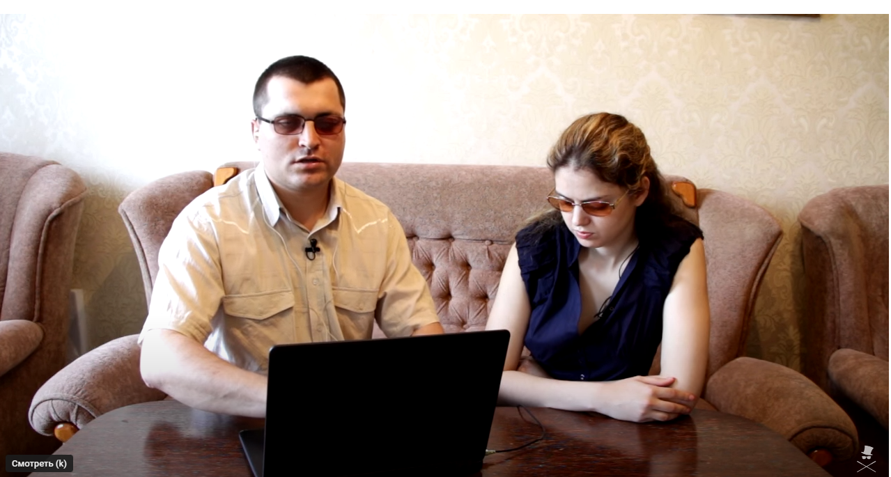
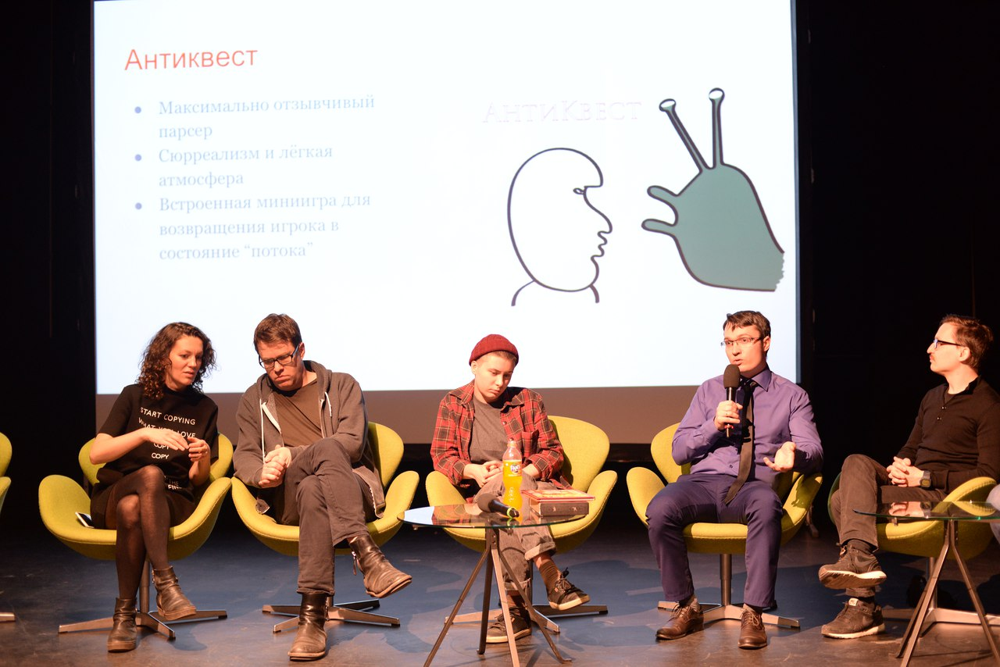
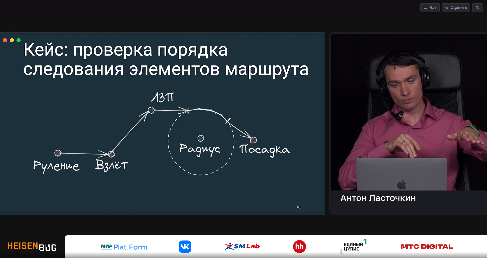
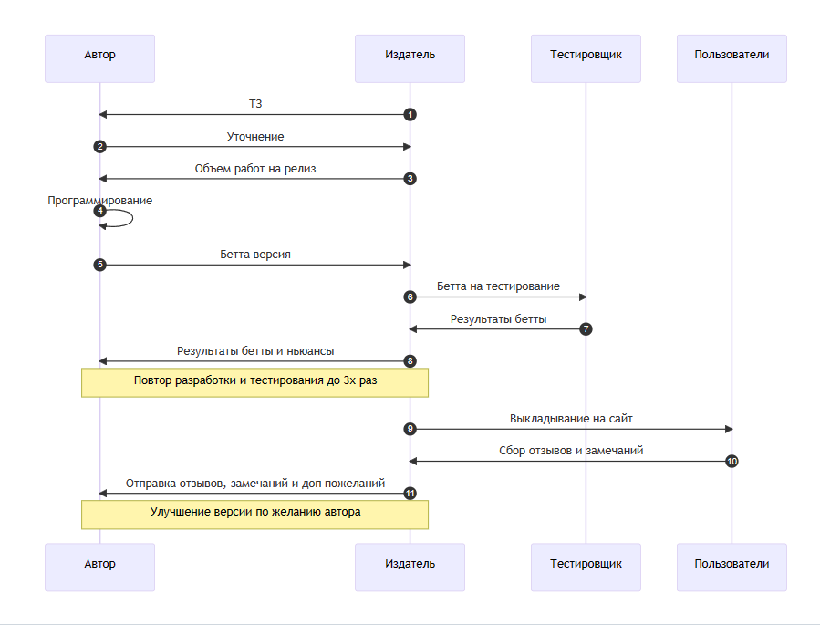
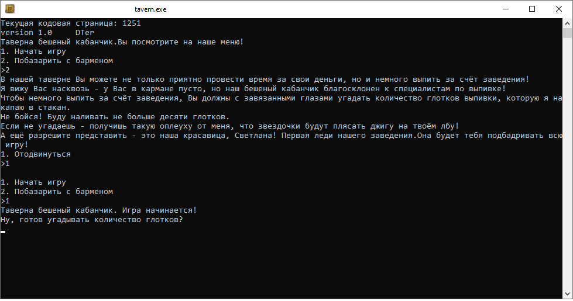
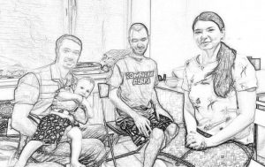

<!-- Generate from root folder: >marp --allow-local-files --pdf about\welcome.md -->

# Dialas
"Команда текстового инди-геймдева"

Сайт: https://dialas.ru/
Канал ТГ https://t.me/dialasgames
Подкасты: [Яндекс](https://music.yandex.ru/album/23165344)  [Гугл](https://podcasts.google.com/feed/aHR0cHM6Ly9kaWFsYXMucnUvY2F0ZWdvcnkvZ2FtZS1yZXZpZXcvZmVlZC8?hl=RU)  [Эппл](https://podcasts.apple.com/us/podcast/dialas-audio/id1637453470) [Cast box](https://castbox.fm/channel/id5024529?utm_source=podcaster&utm_medium=dlink&utm_campaign=c_5024529&utm_content=Dialas%20audio-CastBox_FM) [RSS сайта](https://dialas.ru/feed/podcast)

---
# Сферы деятельности

* Разработка текстовых игр для незрячих и слабовидящих
* Доступные плееры текстовых игр под десктопные и мобильные платформы
* Обзоры интересных новинок из мира Interactive Fiction
* Конкурсы для игроков
* Обучающие игры
---
# 😱What!? Слепые и игры для ПК?

Ликбез о том, как незрячие играют в компьютерные игры: https://www.youtube.com/watch?v=KMn7cATuyZw
---
---

# Давайте в числах!

* ## 🕰️ Работаем с `2016` года
* ## 🎲 Более `20` игровых проектов
* ## 🕹️ `3` плеера с доступностью для невизуальной работы
* ## 🗐 Более `150` постов по интерактивной литературе, включая обзоры на игры
---
# Отец-основатель

Ласточкин Антон

* 3 место на конкурсе интерактивной литературы КРИЛ-2016 с игрой [Каратель шестого поста](https://ifwiki.ru/%D0%9A%D0%B0%D1%80%D0%B0%D1%82%D0%B5%D0%BB%D1%8C_%D1%88%D0%B5%D1%81%D1%82%D0%BE%D0%B3%D0%BE_%D0%BF%D0%BE%D1%81%D1%82%D0%B0)
* Сценарист и разработчик серии игр "Фуга", "Комбикорм" и др.
* Но это было давно, а теперь...

---

* 16+ лет разработки Embedded, backend, desktop на С++
* Преподаватель нетология (направление С++) и Яндекс.Практикум (бекенд С++)
* Спикер на российских конференциях
Подробнее на http://antlas.ru

---
# Что мы предлагаем:
1. Участие в качестве разработчика в команде Диалас
2. Поддержка в течение проекта, детальное тестирование
3. Выкладывание результатов на сайт, обратная связь от игроков
4. Удобный порядок работы по проекту
5. Ограниченное, четкое и понятное ТЗ
6. Возможность расширить ТЗ в свою пользу, добавить элементы, которые интересны лично вам

---
# Правила работы по версиям
Подробнее [здесь](https://github.com/antlas1/reqdialas/blob/main/izdat.md)

---

# Какие результаты мы `гарантируем`:
1. Уникальность проекта для портфолио. Каждый проект выполняется только одним автором
2. Проект в результате будет с полной поддержкой accessibility. Этот пункт тоже можно указать в резюме, что вы работали с технологиями невизуальной доступности.
3. Обратная связь от незрячих игроков и тестировщиков (минимум 2 человека)
4. Обратная связь по организации проекта, одно код-ревью от основателя
5. Выкладывание результатов на сайт и на страницу IfWiki
---
Пример игры - клон известной настолки "Монополия"

Оказывается, её не было в доступном русскоязычном варианте!
См. заметку на сайте [Представляем новую игру — «Монополист» dialas.ru](https://dialas.ru/2023/01/21/%d0%bf%d1%80%d0%b5%d0%b4%d1%81%d1%82%d0%b0%d0%b2%d0%bb%d1%8f%d0%b5%d0%bc-%d0%bd%d0%be%d0%b2%d1%83%d1%8e-%d0%b8%d0%b3%d1%80%d1%83-%d0%bc%d0%be%d0%bd%d0%be%d0%bf%d0%be%d0%bb%d0%b8%d1%81%d1%82/)

---

Еще пример, звуковая игра, где надо угадать число капель крепкого напитка в мензурке.
Заметка здесь: [Таверна «Бешеный кабанчик» открылась по новому адресу dialas.ru](https://dialas.ru/2023/03/02/%d1%82%d0%b0%d0%b2%d0%b5%d1%80%d0%bd%d0%b0-%d0%b1%d0%b5%d1%88%d0%b5%d0%bd%d1%8b%d0%b9-%d0%ba%d0%b0%d0%b1%d0%b0%d0%bd%d1%87%d0%b8%d0%ba-%d0%be%d1%82%d0%ba%d1%80%d1%8b%d0%bb%d0%b0%d1%81%d1%8c-%d0%bf/)

---
# Подключайся к команде! Сделай настоящую игру!
