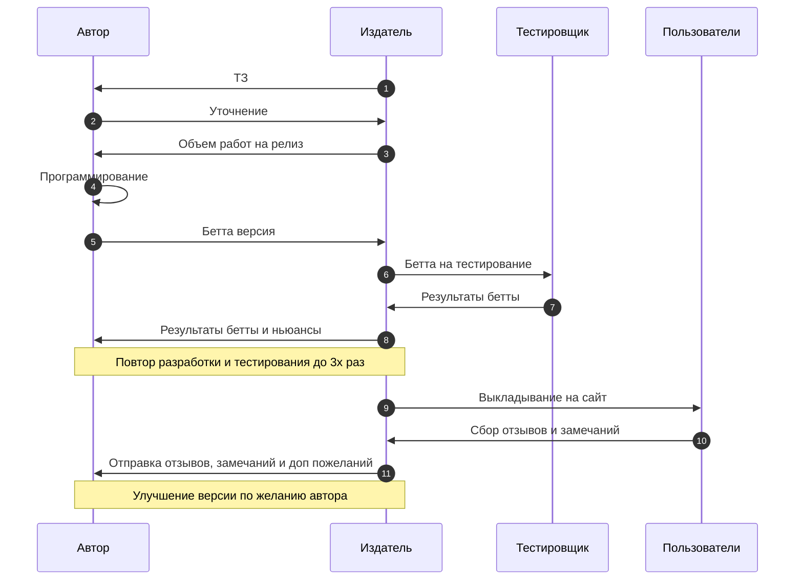

Порядок работы с виртуальным "издательством" Диалас:

```mermaid
sequenceDiagram
    autonumber
    Participant A as Автор
    Participant I as Издатель
    Participant T as Тестировщик
    Participant U as Пользователи
    I ->> A : ТЗ
    A ->> I : Уточнение
    I ->> A : Объем работ на релиз
    A ->> A : Программирование
    A ->> I : Бетта версия
    I ->> T : Бетта на тестирование
    T ->> I : Результаты бетты
    I ->> A : Результаты бетты и ньюансы
    Note over A, I: Повтор разработки и тестирования до 3х раз
    I ->> U : Выкладывание на сайт
    U ->> I : Сбор отзывов и замечаний
    I ->> A : Отправка отзывов, замечаний и доп пожеланий
    Note over A, I: Улучшение версии по желанию автора
```

"Диалас" отбирает идеи для ТЗ и формирует вариант, удобный для реализации начинающим программистам. 