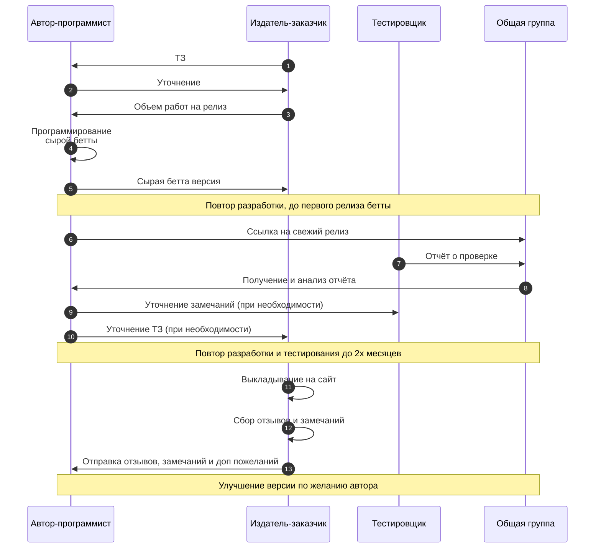

Порядок работы с виртуальным "издательством" Диалас:

"Диалас" отбирает идеи для ТЗ и формирует вариант, удобный для реализации начинающим программистам. 
Особенность "сырой бетты" в том, что не требуется выполнение всего ТЗ, должны быть первые шаги, которые позволят выполнить дымовое тестирование и наать полноценный бетта-тест.
