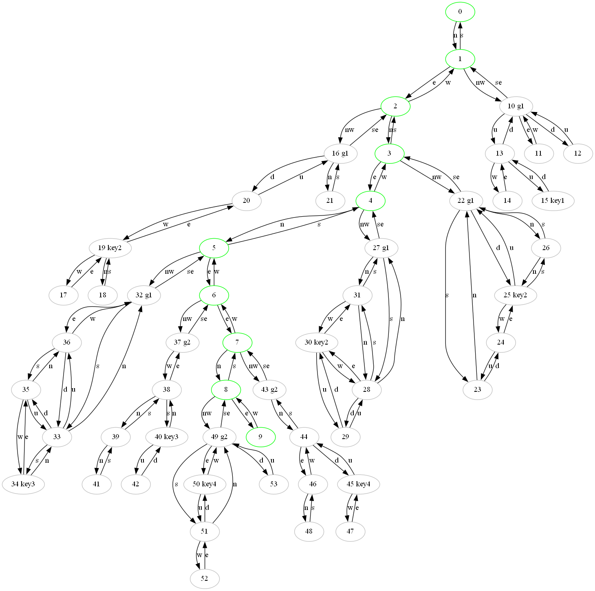

# CYBER_INFILTRATION

## Концепция

Игра представляет собой парсерный шутер. Парсерный означает, что игра должна обрабатывать введённую текстовую команду игрока. Основан на [серии игры зомби](https://ifwiki.ru/%D0%97%D0%BE%D0%BC%D0%B1%D0%B8), но реализация в стиле киберпанк. 

## Геймплей

На карте местности (2D), перемещение по которой выполняется командами "север, юг, запад, восток, вверх, вниз". При появлении ГГ на одной локации с монстром может начаться перестрелка. При этом, есть возможность уйти из текущей локации во время боя (сбежать). Основная цель - достичь финальной локации, где нас ждёт спасение. Вариант топологии карты представлен в **Приложении 1**.

По карте разбросаны аптечки и патроны.

### Построение карты и отладка

Можно сделать хардкод, можно читать из файла. В идеале должен быть текстовый файл (CSV) с таблицей вида для описания карты locations.csv:

```csv
id локации; описание; количество монстров типа 1; количество лечилок; количество патронов;
0; Коридор бункера. Стартовая точка. Проход идёт на север; 0; 0; 0; 0; 0; 0
1; Коридор бункера уровень 1. Проход идёт на запад к следующему уровню; 1; 0; 0; 0; 0; 0;
...
10; Начало зеленого коридора. Можно выйти на юго-восток или двинуться дальше на верх, на запад и вниз; 0; 0; 1; 0; 0; 1
...
15; Тупик под навесом. Можно выйти вниз; 0; 1; 0; 2; 0; 0
```

Получается, мы можем указать в каких локациях содержаться двери, которые открывают проход на следующий уровень (всегда id-больше предыдущего).

Отдельный файл отображает связь между идентификаторами локаций. connections.csv:

```csv
id исходной;id результата;направление
0;1;n
1;0;s
1;10;nw
10;1;se
...
```

Еще файл предназначен для установки параметров оружия, HP героя, монстров. Нужен для дальнейшего баланса.

### Расчёт очков

Очки за игру рассчитываются как суммарный нанесенный урон. 

### Архитектура ПО

Самая простая архитектура - процедурно-ориентированная. Есть набор структур и массивов для хранения. Обработка по сути меняет карту.


Псевдокод главной функции:

```cpp
int main()
{
    Map map;
    //1. Считывание комнат из файла locations.csv, заполнение map.rooms в части описаний.
    //пока можно заменить коснтантами
    //id комнаты - просто позиция в массиве, напрямую в структуры не кладётся
    //параллельно надо заполнять массив с монстрами и давать указатель на текущую комнату
    //2. Считывание направлений из connections.csv, заполнение map.rooms в части указателей

    //3. Основной цикл игры
    while(true)
    {
       cin >> user_inpout;
       std::string res = game_loop(user_inpout, map);
       cout << res;
    }
}
```

Основной цикл обработки следующий:

```cpp
std::string game_loop(std::string input, Map& map)
{
    //функция парсит строку и переводит текст в id команды и её строковый аргумент, может отстусвовать
    CommandId, CommandArg = parse_input(input);
    //флаг, что необходимы дополнительные команды и действия для боевого режима
    bool is_battle_mode = getMonstersOnLocation(map.hero.location);
    std::string output;
    switch(CommandId)
    {
       case CmdNorth: //хотим идти на север
           if (map.hero.location->north) //можем ли пойти на север
           {
                map.hero.location = map.hero.location->north; //переходим
                output = map.hero.location->ldesc; //для возврата даём описание
           }
           else //не можем пройти
           {
               output = "Туда не пройти!"
           }
       break;
       //подключаем команды, которые разрешены в боевом режиме
      ...
    }
    //проверяем, нужна ли обработка боевого режима
    if (is_battle_mode)
    {
        processBattle(map.hero,getMonstersOnLocation(map.hero.location))
    }
    //после обработки ввода пользователя, надо выполнить обновление монстров на карте, они могут давать урон
    output += updateMonsters()
    return output;
}
```

После смерти монстра, его локация становиться 0, его дальше не обслуживаем.


## Приложение 1. Карта местности



## Приложение 2. Основные команды игры

| Команда (список однотипных команд)                                                                                            | Пример                        | Описание                                                                                                                                                                     |
| ----------------------------------------------------------------------------------------------------------------------------- | ----------------------------- | ---------------------------------------------------------------------------------------------------------------------------------------------------------------------------- |
| север(с), юг(ю), запад(з), восток(в), северо-запад(сз), северо-восток(св), юго-запад(юз), юго-восток(юв), вверх(вв), вниз(вн) | >с                            | переводит ГГ в новую локацию. Если такого направления нет, необходимо сообщить - "вы не можете пройти в этом направлении"                                                    |
| ждать (ж)                                                                                                                     | >ж                            | Пропускает ход, при                                                                                                                                                          |
| осмотреть (осм, о)                                                                                                            | >о себя <br>>о синего <br> >о | Осматривает себя (показывает характеристи хп, количество боеприпасов, ресурсов). Осматривает монстра - показывает его описание. Осматривает локацию - повторяет её описание. |
| стрелять                                                                                                                      | >застрелить синего            | если есть "стрел", то затем надо смотреть часть имени монстра. Работает, когда выбран револьвер.                                                                             |
| патроны(обойма)                                                                                                               | >патроны разрывные            | выбор типа патронов, если уже были синтезированы.                                                                                                                            |
| помощь (справка)                                                                                                              | >помощь                       | выдаёт список команд                                                                                                                                                         |

## 
