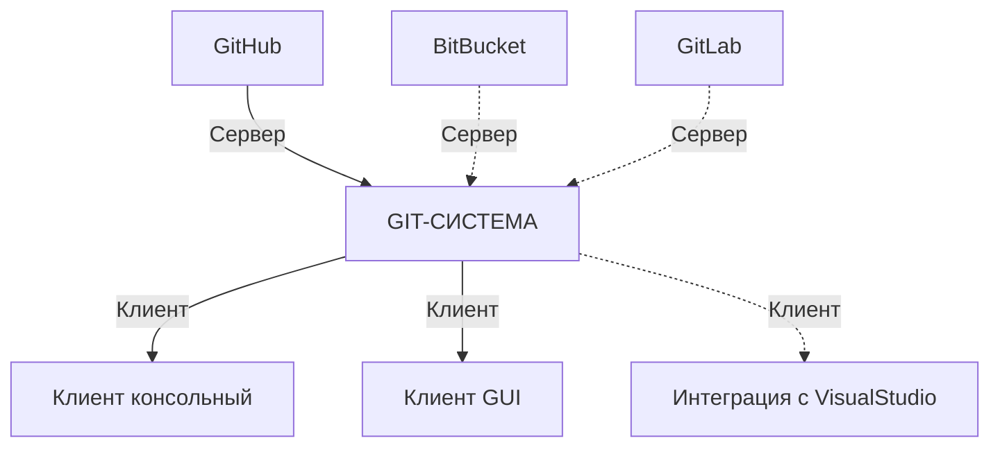
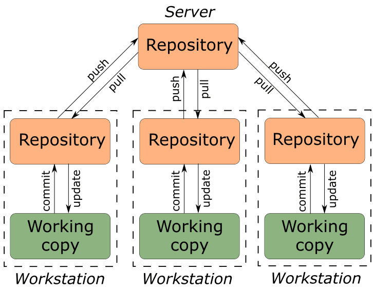
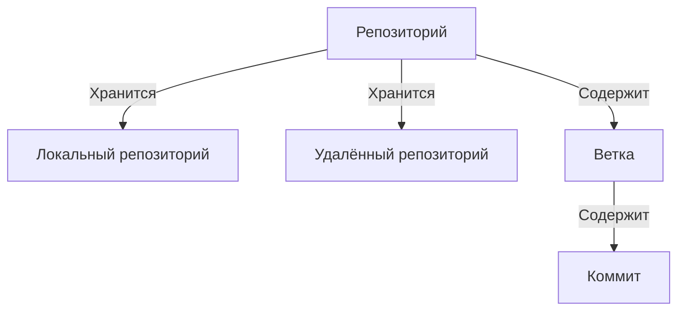
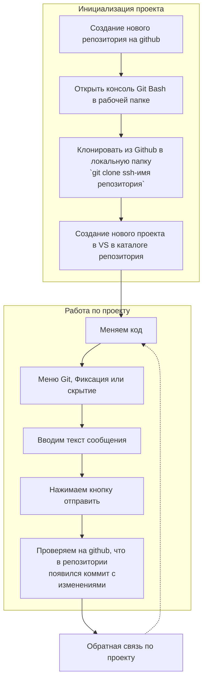

# Типовые сценарии работы с git

### Предварительные требования

<details>
<summary> ✔ Установлен Git-клиент на своем локальном компьютере</summary><p>

* Правой кнопкой нажимаем на рабочем столе, есть в контекстном меню GIT GUI Here, Git Bash Here.

* Открываем Git Bash Here и набираем `git version`

 
Подробно: [guides/git/README.md at master · netology-code/guides (github.com)](https://github.com/netology-code/guides/blob/master/git/README.md) 

</p></details>

<details>
<summary> ✔ Создан профиль на GitHub сервере</summary><p>

* Заходите на сайт github.com, нажимаете Sign In, логинетесь со своими данными

* Отображается ваша домашняя страничка


Подробно: [guides/github/README.md at master · netology-code/guides](https://github.com/netology-code/guides/blob/master/github/README.md)

</p></details>

<details>
<summary> ✔ Настроена конфигурация для гит-клиента имя пользователя и email на своем локальном компьютере </summary><p>
  
* Правой кнопкой нажимаем на рабочем столе, 
`git --global user.name`, `git --global user.email`. Выдача примерно такая (версия может отличаться):

Подробно: [guides/git-terminal/git-terminal.md at master · netology-code/guides (github.com)](https://github.com/netology-code/guides/blob/master/git-terminal/git-terminal.md#%D0%BF%D0%B5%D1%80%D0%B2%D0%BE%D0%BD%D0%B0%D1%87%D0%B0%D0%BB%D1%8C%D0%BD%D0%B0%D1%8F-%D0%BD%D0%B0%D1%81%D1%82%D1%80%D0%BE%D0%B9%D0%BA%D0%B0-git) 

</p></details>

<details>
<summary> ✔ Настроен SSH-ключ </summary><p>

* Правой кнопкой нажимаем на рабочем столе Git Bash here,  ввести
`ls ~/.ssh`. Выдача примерно такая (версия может отличаться):

* Заходим в настройки гитхаб, SSH and GPG keys. Смотрим, что там тоже есть ключ:

Подробно: [guides/git-ssh at master · netology-code/guides (github.com)](https://github.com/netology-code/guides/tree/master/git-ssh)

</p></details>

<details>
<summary> ✔ Есть понимание клиент-серверной природы ГИТ и знакомство с основными понятиями </summary><p>

### Система контроля версий



GIT-СИСТЕМА - гит как система для контроля версий имеет локальную часть, которая ставится на рабочую машину разработчика и серверную часть (аналог облакак), которая настраивается через веб-интерфейс. При этом работа с гит происходит однообразно через гит-клиенты и стандартные операции.




### Основные сущности



**Репозиторий** — некий каталог файловой системы, в котором находятся служебные файлы гит помимо файлов.     
**Локальный репозиторий** — репозиторий, расположенный на локальном компьютере разработчика в каталоге. Именно в нём происходит разработка и фиксация изменений, которые отправляются на удаленный репозиторий.    
**Удаленный репозиторий** — репозиторий, находящийся на удаленном сервере. Это общий репозиторий, в который приходят все изменения, и из которого забираются все обновления.    
**Коммит** (Commit) — это объект, содержащий информацию об изменённых файлах. Представляйте его себе в виде zip-архива с подписью-хешем.    
**Ветка** (Branch) — это отдельная история изменений (**коммитов**) в рамках одного репозитория.    

</p></details>

### Сольная разработка github + visual studio


### Сольная разработка github + текстовый редактор

1. Создание нового репозитория на github. SSH ссылка будет вида: `git@github.com:<user>/<repo name>.git`
2. Вы открываете Git Bash в рабочей папке, где будет репозиторий, далее клонируем и переходим туда и проверяем, что склонировался, всё чисто 
```cmd
>git clone git@github.com:<user>/<repo name>.git
(появляется новый каталог <repo name>)
>cd <repo name>
>git status
On branch main
Your branch is up to date with 'origin/main'.

nothing to commit, working tree clean
```
3. Добавляем файлы, работаем в каталоге. Например появился новый файл `main.cpp`. 
4. Добавляем файлы для коммита, проверяем что добавились, называем коммит и отправляем в удалённый репозиторий на github:
```cmd
>git status
(Файлы будут в списке и красного цвета)
On branch main
Your branch is up to date with 'origin/main'.

Untracked files:
  (use "git add <file>..." to include in what will be committed)
        main.cpp

nothing added to commit but untracked files present (use "git add" to track)
>git add .
(добавляем все новые файлы и каталоги)
>git status
(Файлы будут в списке и зеленого цвета)
>git commit -m "Add main txt"
(подготовили коммит, назвали его, готовы пушить)
>git push
(отправка, проверяем что всё ок)
```


### Материалы

* [Git и командная разработка (для чайников) | ВКонтакте (vk.com)](https://vk.com/@javarush-git-i-komandnaya-razrabotka-dlya-chainikov)
* [Шпаргалка по Git от GitHub - GitHub Cheatsheets](https://training.github.com/downloads/ru/github-git-cheat-sheet/)
* [Ссылка на большой список ссылок материалов по ГИТ](https://github.com/netology-code/guides/blob/master/git-basics/GitMaterialsAll.md)
