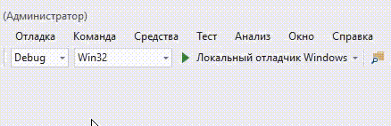
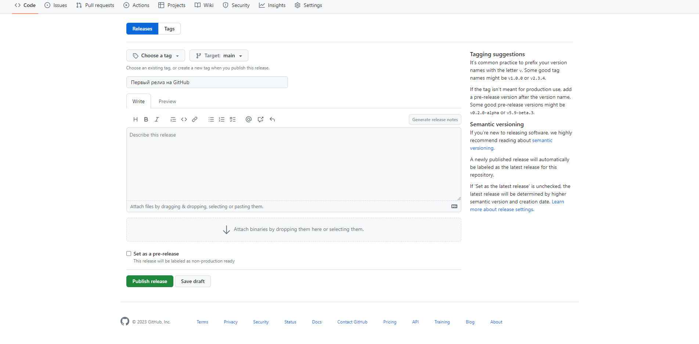
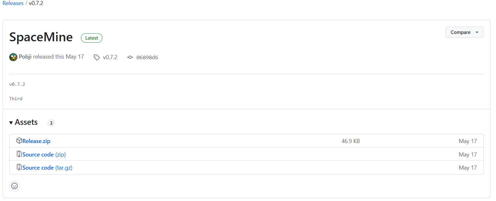

Подготовка к релизу должна заключать в себя следующие шаги:
1. Добавить пункт меню с выводом имени автора, версии игры и, по-желанию, "Диалас". Пример запуска консольного приложения:
```cmd
Приветствуем вас в супер-игре на выживание! 
Выберите пункт меню:
1. Начать нереальный хардкор
2. Об авторе
3. Покинуть эту замечательную игру
>2
Автор: Ярополк Светозарович Громобоев (ник Lapochka)
Версия: 1.0
Совместно с Dialas

Выберите пункт меню:
1. Начать нереальный хардкор
2. Об авторе
3. Покинуть эту замечательную игру
>3
Лондон, гуд бай...
```
2. Если игра планируется на выкладываете на GitHub, то просьба указать лиценцию (в корне репозитория LICENSE). Рекомендую лицензию [MIT](https://opensource.org/license/mit/), коротенькая, понятная.
<details>
<summary>Пример текста лицензии</summary>
  
```
MIT License

Copyright (c) 2023 Lapochka

Permission is hereby granted, free of charge, to any person obtaining a copy
of this software and associated documentation files (the "Software"), to deal
in the Software without restriction, including without limitation the rights
to use, copy, modify, merge, publish, distribute, sublicense, and/or sell
copies of the Software, and to permit persons to whom the Software is
furnished to do so, subject to the following conditions:

The above copyright notice and this permission notice shall be included in all
copies or substantial portions of the Software.

THE SOFTWARE IS PROVIDED "AS IS", WITHOUT WARRANTY OF ANY KIND, EXPRESS OR
IMPLIED, INCLUDING BUT NOT LIMITED TO THE WARRANTIES OF MERCHANTABILITY,
FITNESS FOR A PARTICULAR PURPOSE AND NONINFRINGEMENT. IN NO EVENT SHALL THE
AUTHORS OR COPYRIGHT HOLDERS BE LIABLE FOR ANY CLAIM, DAMAGES OR OTHER
LIABILITY, WHETHER IN AN ACTION OF CONTRACT, TORT OR OTHERWISE, ARISING FROM,
OUT OF OR IN CONNECTION WITH THE SOFTWARE OR THE USE OR OTHER DEALINGS IN THE
SOFTWARE.
```
  
</details>

3. Выполнить сборку проекта
<details>

<summary>Сборка релиза для C++</summary>

**ВНИМАНИЕ!** Сборка подразумевает ОС Windows. Работать можно в любой ОС, но релизить обязательно в винде.

* Собрать версию в релиз-режиме. У пользователей не будет debug-библиотек. Теперь наш проект можно собрать, но до сборки необходимо выбрать тип сборки release. Ниже пример выбора сборки релиз в IDE Microsoft Visual Studio:



* Проверить, что запускается и работает.
* Запаковать экзешник и ресурсы в zip и проверить на всякий случай в [VirusTotal](https://www.virustotal.com/gui/) . Были прецеденты из-за особенностей парсинга пользовательского ввода и разрядности компилятора защитник windows определял как вирус. Лучше перестраховаться, люди могут и не запустить ваше творение.
* 

</details>
<details>

<summary>Сборка релиза для Python</summary>

* Собрать скрипт в экзешник с помощью [PyInstaller](https://pyinstaller.org/en/stable/) или [FrontPage - py2exe.org](http://www.py2exe.org/).
* Проверить в среде, где нет установленного питона.
* Запаковать экзешник и ресурсы в zip и проверить на всякий случай в [VirusTotal](https://www.virustotal.com/gui/) . Были прецеденты из-за особенностей парсинга пользовательского ввода и разрядности компилятора защитник windows определял как вирус. Лучше перестраховаться, люди могут и не запустить ваше творение.

</details>

4. Выложить в облако. Я рекомендую для OpenSource проектов в github releases. Очень подробная инструкция тут: [Managing releases in a repository - GitHub Docs](https://docs.github.com/en/repositories/releasing-projects-on-github/managing-releases-in-a-repository). Краткая инструкция:
> Релиз (release) — это готовое приложение и одноименная страница с его исходным кодом на GitHub.

Чтобы создать релиз, зайдите на страницу репозитория и найдите Create a release справа. На новой странице можно будет указать его заголовок и описание, а также выбрать ветку, которую вы представите как готовое приложение. Дальше останется только нажать Publish release и сохранить все это.

**Внимание!** Где стрелочка, там не забудьте добавить ваш зип файл с релизом (сборкой). В результате в релизе будет 3 ассета:



5. Уведомить "издателя" о новом релизе и почивать на лаврах!
